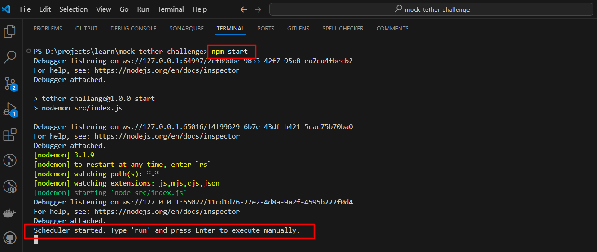
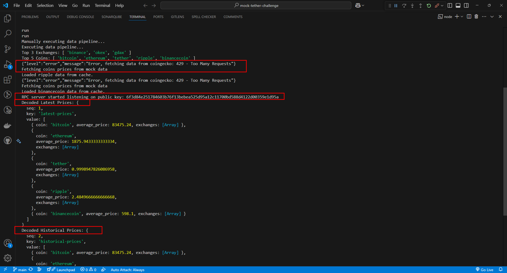

---

# 🚀 **Crypto Data Pipeline**  

### 📌 **Steps to Run the Project**  

### 🛠 **1. Clone the Repo**  
```sh
git clone https://github.com/more03625/tether-challenge.git
cd tether-challenge
```

### 📦 **2. Install Dependencies**  
Run the following command inside the project directory:  
```sh
npm install
```

### ▶️ **3. Start the Application**  
```sh
npm start
```
- This will initialize the server.  

### 🔑 **4. Public Key Generation & Data Fetching**  
- The server will generate a **public key**.  
- The client will use this key to fetch **latest** & **historical** crypto prices.  

### 📊 **5. View Average Prices**  
- The **average prices** will be printed in the console.  

### ⏳ **6. Run Data Pipeline Manually**  
Type `run` in the terminal to execute the pipeline manually:  
```
📅 Scheduler started. Type 'run' and press Enter to execute manually.

⏳ Running scheduled data pipeline...
⚡ Executing data pipeline...
...

# If you type 'run' and press Enter:
⚡ Manually executing data pipeline...
⚡ Executing data pipeline...
```

### 📸 **7. Screenshots**  
🛠️ **Running the Project:** Start the server and execute the data pipeline.

  

🖥️ **Logs in terminal:** See the terminal logs for `latest` & `historical` prices.

  

---

🔥 **Now you're all set!** The pipeline will run **automatically** at scheduled intervals, but you can also trigger it manually anytime. Happy coding! 🚀